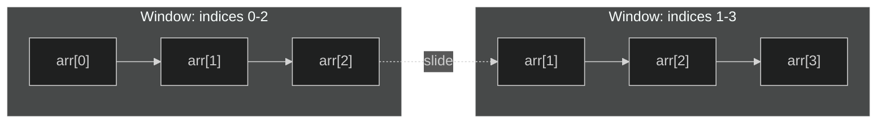
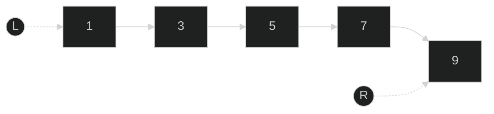
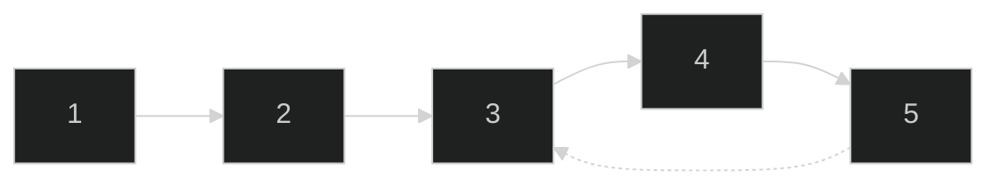
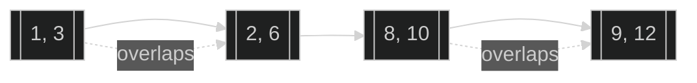
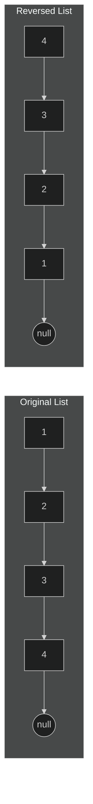
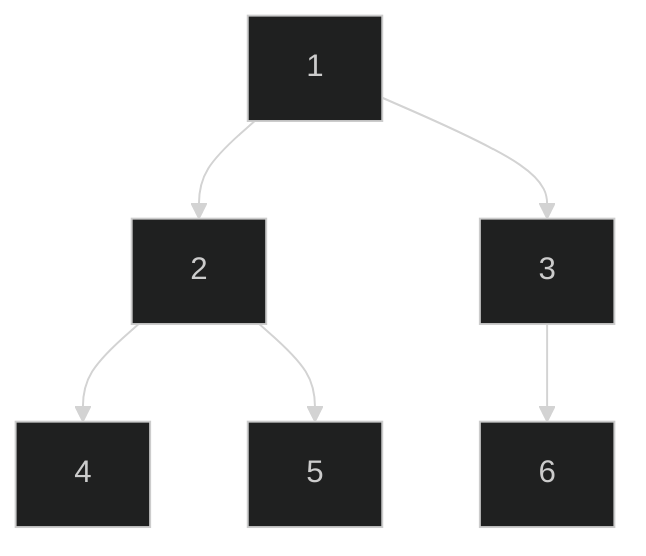
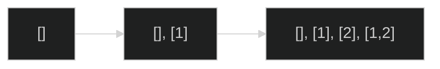
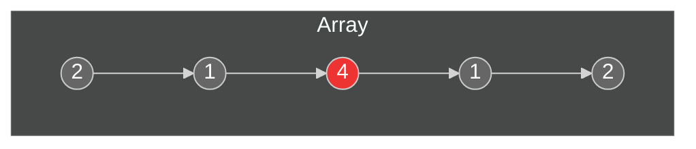
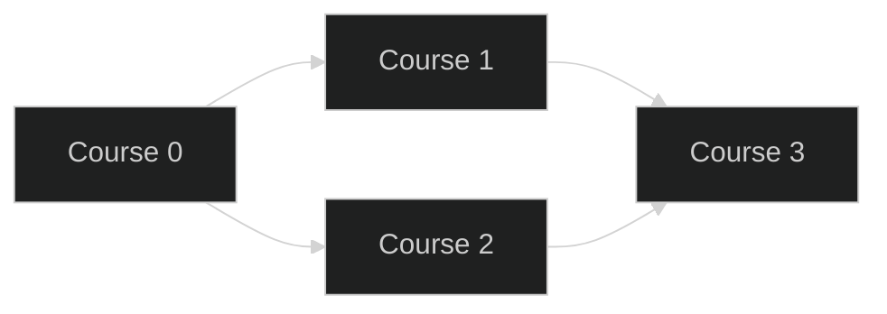
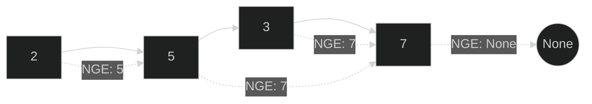

## 1. Sliding Window Pattern

The **Sliding Window** pattern is used to efficiently compute something over every subset of a sequence of fixed size or that meets certain conditions, by maintaining a "window" that slides through the data. It's useful for problems like finding the maximum or minimum sum of a subarray of length _k_, or any problem where you need to consider contiguous sequences in an array or string. Instead of recomputing from scratch for each possible subsequence, the sliding window pattern reuses computations from the previous window, achieving a significant performance boost (often reducing complexity from O(n·k) to O(n) for a window size _k_).

For example, consider finding the maximum sum of any contiguous subarray of length `k` in an array of integers. A brute-force approach would compute the sum of every possible subarray of length `k`, which is inefficient. Using a sliding window, we can move a window of size `k` along the array, adding the new element that enters the window and removing the element that leaves, keeping track of the running sum and maximum as we go.



In the diagram above, each subgraph represents a window of size 3 moving along the array. The window slides by one position, reusing two elements (`arr[1]` and `arr[2]`) from the previous window and including one new element (`arr[3]`). This illustrates how the computation for overlapping segments is shared in a sliding window.

Below is a C# example that finds the maximum sum of any subarray of length `k`:

```csharp
public int MaxSubArraySum(int[] arr, int k) {
    if (arr.Length < k || k <= 0) return 0;
    long windowSum = 0;
    long maxSum = long.MinValue;
    // Build initial window
    for (int i = 0; i < k; i++) {
        windowSum += arr[i];
    }
    maxSum = windowSum;
    // Slide the window through the array
    for (int end = k; end < arr.Length; end++) {
        windowSum += arr[end] - arr[end - k];
        maxSum = Math.Max(maxSum, windowSum);
    }
    return (int)maxSum;
}
```

**How it works:** We first compute the sum of the first `k` elements as the initial window. Then, for each subsequent element in the array (from index `k` to the end), we slide the window forward by one: add the new element entering the window and subtract the element that just fell out of the window. We update the `maxSum` if the current window's sum is greater. This way, each element is visited only once (added once and removed once), resulting in O(n) time complexity. A naive approach would recompute the sum for each window from scratch, leading to O(n·k) time, which is much slower for large `n`. The sliding window approach is memory efficient as well, using only a few extra variables.

## 2. Two Pointer Pattern

The **Two Pointer** pattern uses two indices (or pointers) that move through the data structure (usually an array or linked list) from opposite ends or at different rates to converge on a solution. This approach is commonly used for sorted arrays or linked lists to find pairs that fulfill a certain condition (like two numbers that add up to a target sum, or finding a pair with minimum difference). It’s also used in problems like reversing an array in-place, or checking for palindromes (with one pointer starting at the beginning and another at the end of a string).

By using two pointers, we can often avoid nested loops and achieve linear time complexity. For example, if we have a sorted array and we want to find two numbers that sum to a given target, we can initialize one pointer at the start and another at the end of the array. Then, we move the pointers inward: if the sum of values at both pointers is too low, we move the left pointer to the right (to increase the sum); if it’s too high, we move the right pointer to the left (to decrease the sum). This way, we systematically narrow down the possibilities in one pass.



_In the diagram, two pointers start at the leftmost (L) and rightmost (R) ends of the array [1, 3, 5, 7, 9]. They will move towards each other until they find a pair that meets the condition (in this example, if we were looking for a sum of 10, L would move right and R left until pointing at 3 and 7)._

Here’s a C# example using two pointers to find two indices in a sorted array that sum to a target value:

```csharp
public int[] TwoSumSorted(int[] arr, int target) {
    int left = 0;
    int right = arr.Length - 1;
    while (left < right) {
        int sum = arr[left] + arr[right];
        if (sum == target) {
            return new int[] { left, right };
        }
        if (sum < target) {
            left++;    // sum too small, move the left pointer to the right
        } else {
            right--;   // sum too large, move the right pointer to the left
        }
    }
    // No pair found
    return Array.Empty<int>();
}
```

**Why it’s efficient:** By leveraging the sorted order (or some inherent structure) of the data, the two-pointer strategy eliminates the need for a double loop through all pairs (which would be O(n²)). Instead, it achieves O(n) time complexity by moving the pointers intelligently. For an unsorted array, a similar problem could be solved by sorting the array first (O(n log n)) and then using two pointers, or by using a hash set/dictionary to find complements in O(n) time (a different pattern). Two pointers are also useful in other scenarios, such as partitioning arrays (Dutch national flag problem) or merging sorted lists from both ends.

## 3. Fast & Slow Pointers Pattern

The **Fast & Slow Pointers** (also known as the "tortoise and hare" algorithm) involves two pointers moving through a structure at different speeds, typically one moving twice as fast as the other. This pattern is especially useful for detecting cycles in linked lists or arrays, finding the middle of a linked list, or determining other properties of cyclic or converging sequences.

A classic application is **cycle detection in a linked list**: If you advance one pointer (`fast`) by two nodes for every one node the other pointer (`slow`) moves, they will eventually meet if there is a cycle (loop) in the list. If there's no cycle, the fast pointer will reach the end (null) first. Another use of this pattern is to find the middle of a linked list in one pass – when the fast pointer reaches the end, the slow pointer will be at the midpoint.



_The diagram shows a linked list where node 5 links back to node 3, forming a cycle (3 → 4 → 5 → 3...). Using a fast pointer that moves two steps at a time and a slow pointer that moves one step at a time, they will eventually meet at some node within the cycle (confirming that a cycle exists)._

Below is a C# example that checks if a linked list has a cycle using the fast/slow approach. (We assume a `ListNode` class with an integer value field `val` and a `next` pointer):

```csharp
public bool HasCycle(ListNode head) {
    ListNode slow = head;
    ListNode fast = head;
    while (fast != null && fast.next != null) {
        slow = slow.next;
        fast = fast.next.next;
        if (slow == fast) {
            return true;  // fast caught up to slow, cycle detected
        }
    }
    return false;  // reached end of list, no cycle
}
```

If a cycle is detected and you need to find the exact node where the cycle begins, you can reset one pointer to the head and then move both pointers at the same speed; the point at which they meet again will be the start of the cycle. The fast & slow pattern runs in O(n) time and O(1) space, since it uses only two pointers.

## 4. Merge Intervals Pattern

The **Merge Intervals** pattern is a technique to deal with overlapping intervals. When given a collection of intervals (each interval typically defined by a start and end value), the goal is often to merge all overlapping intervals into consolidated ranges. This pattern arises in scenarios like calendar event merging, data compaction, or any situation where you need to simplify a set of ranges by merging those that overlap.

The approach is straightforward: first, sort the intervals by their start times. Then, iterate through the sorted list and use a running "current" interval that you extend whenever the next interval overlaps with it. If the next interval does not overlap, you add the current interval to the result list and start a new current interval.



_In the diagram, the intervals [1,3] and [2,6] overlap and would merge into [1,6]. Likewise, [8,10] and [9,12] overlap and merge into [8,12]. Intervals that do not overlap remain separate in the output._

Here's how you can merge overlapping intervals in C#:

```csharp
public int[][] MergeIntervals(int[][] intervals) {
    if (intervals.Length == 0) return new int[0][];
    // Sort intervals by start time
    Array.Sort(intervals, (a, b) => a[0].CompareTo(b[0]));
    var merged = new List<int[]>();
    int[] current = intervals[0];
    merged.Add(current);
    foreach (var interval in intervals) {
        if (interval[0] <= current[1]) {
            // Overlapping intervals, adjust the end if needed
            current[1] = Math.Max(current[1], interval[1]);
        } else {
            // Disjoint interval, add to list
            current = interval;
            merged.Add(current);
        }
    }
    return merged.ToArray();
}
```

**How it works:** After sorting, we only need a single pass to merge intervals. We keep track of a `current` interval. For each new interval, if it overlaps (its start is <= current end), we update the end of the current interval to the max of both ends (effectively merging them). If it doesn't overlap (its start is greater than the current end), we finalize the current interval and start a new one. The result is a list of non-overlapping intervals covering the same ranges as the input. This algorithm runs in O(n log n) time due to sorting, followed by O(n) for merging. In terms of space, it uses O(n) for the output list.

## 5. Cyclic Sort Pattern

The **Cyclic Sort** pattern is an in-place sorting strategy for problems where numbers are in a known range (for example, 1 to _n_ or 0 to _n_). The idea is to keep swapping elements until every number is in its correct index (position), cycling through elements as necessary. This pattern is particularly effective for finding missing or duplicate numbers in a range, because once the array is "mostly sorted" with each number at its index, any index that doesn't have the correct number indicates a problem (like a missing or duplicate number).

**Use cases:** Finding the smallest missing positive number, finding a missing number in a consecutive range, finding duplicates or all missing numbers in an array where values fall within a specific range.

**Approach:** Iterate through the array, and whenever the current element is not at the correct index (and the target index is within bounds), swap it with the element at its correct index. Continue this until the current index has the right value or the value is out of the expected range. Then move to the next index. After this procedure, the array will be rearranged such that any number that can be in its rightful position is there.

After the cyclic sort, a second pass is often used to identify the anomaly. For example, to find the first missing number, you scan through and find the first index `i` such that `arr[i] != i` (or `arr[i] != i+1` depending on 0-based or 1-based indexing scheme). That index (or index + 1) is the missing number. If all indices match, then the missing number is at the end of the range.

Here's an example in C# that finds a missing number from an array containing numbers 0 through _n_ (inclusive) with one missing:

```csharp
public int FindMissingNumber(int[] nums) {
    int i = 0;
    int n = nums.Length;
    // Cyclic sort: place each number at its index if possible
    while (i < n) {
        if (nums[i] < n && nums[i] != i) {
            // Swap nums[i] with nums[nums[i]]
            int correctIndex = nums[i];
            int temp = nums[correctIndex];
            nums[correctIndex] = nums[i];
            nums[i] = temp;
            // do not increment i here, to recheck the new number at position i
        } else {
            i++;
        }
    }
    // After sorting, find the first index where index != value
    for (int j = 0; j < n; j++) {
        if (nums[j] != j) {
            return j;
        }
    }
    // If all indices have correct values, the missing number is n
    return n;
}
```

In this code, we continuously swap elements into their correct positions: if `nums[i]` is not at index `i` and is less than `n` (meaning it's a number that should be placed in the array indices), we swap it with the element at its target index. We don't increment `i` in that case, because after swapping, we need to check the new number that came to index `i`. If the number is already in the correct place or it’s `n` (the number outside 0..n-1 range), we move on. Finally, we find the first index `j` where `nums[j] != j`, which indicates that `j` is the missing number. If none found, the missing number is `n` (meaning the array contained 0..n-1 and missing _n_ itself).

**Why not just sort or use sum?** A normal sort would be O(n log n) and use more memory; cyclic sort does it in O(n) time and O(1) space by exploiting the value range. Using a sum or XOR formula can find a single missing number more easily, but cyclic sort extends to finding multiple missing numbers or duplicates in one pass, which those arithmetic methods can't do as directly. The cyclic sort pattern is a versatile method for several "find the missing/duplicate number" problems.

## 6. In-Place Reversal of Linked List Pattern

The **In-Place Reversal of a Linked List** pattern is used to reverse a linked list (or part of it) by rearranging the node links instead of using additional memory. This is a common pattern for problems that require you to reverse the order of nodes in a linked list, either entirely or partially (for example, reversing every k-group of nodes, or reversing a sub-section of a list).

Reversing a linked list in-place can be done by iteratively adjusting pointers as you traverse the list. The strategy is to maintain three pointers: one for the current node you're visiting, one for the previous node (to which you'll point the current node's `next`), and one for the next node (to not lose track of the remaining list). At each step, you reverse the `next` pointer of the current node to point to the previous element.



_The diagram shows an original linked list (1 → 2 → 3 → 4 → null) and the reversed list (4 → 3 → 2 → 1 → null) after applying the in-place reversal pattern._

Below is a C# function that reverses a singly linked list in place. (We assume the `ListNode` class is defined with fields `val` and `next`):

```csharp
public ListNode ReverseList(ListNode head) {
    ListNode prev = null;
    ListNode current = head;
    while (current != null) {
        ListNode nextNode = current.next;  // temporarily store the next node
        current.next = prev;              // reverse the current node's pointer
        prev = current;                   // move prev one step forward
        current = nextNode;               // move current one step forward
    }
    return prev;  // prev becomes the new head at the end of the loop
}
```

This algorithm runs in O(n) time and uses O(1) extra space, since the reversal is done by re-linking nodes on the fly. It works by pushing `current` forward through the list and redirecting its pointer to the accumulating `prev` list behind it. By the end of the loop, `prev` points to the new head of the reversed list. An alternative approach is to use recursion to reverse the list, but the iterative solution is often preferred for its clarity and no risk of stack overflow on long lists.

## 7. Tree Breadth-First Search (BFS) Pattern

The **Breadth-First Search (BFS)** pattern for trees (and graphs) explores nodes level by level. In a binary tree, this translates to visiting all nodes at depth 0 (the root), then depth 1, then depth 2, and so on. BFS is often used to solve problems like "level order traversal" (collecting values level by level), finding the shortest path in an unweighted graph, or other problems where exploring neighbors first is beneficial.

For example, performing a level-order traversal of a binary tree is a direct application of BFS. We use a queue data structure to achieve this: start by enqueueing the root, then repeatedly dequeue a node, process it, and enqueue its children (left and right child for a binary tree) for later processing. This ensures that nodes are visited in increasing order of depth.



_The diagram illustrates a binary tree with root 1. BFS traversal of this tree would visit nodes in the order: 1 (level 0), then 2, 3 (level 1), then 4, 5, 6 (level 2)._

Below is a C# example of BFS on a binary tree, returning the values level by level:

```csharp
public List<List<int>> LevelOrderTraversal(TreeNode root) {
    var result = new List<List<int>>();
    if (root == null) return result;
    var queue = new Queue<TreeNode>();
    queue.Enqueue(root);
    while (queue.Count > 0) {
        int levelSize = queue.Count;
        var currentLevel = new List<int>();
        for (int i = 0; i < levelSize; i++) {
            TreeNode node = queue.Dequeue();
            currentLevel.Add(node.val);
            if (node.left != null) queue.Enqueue(node.left);
            if (node.right != null) queue.Enqueue(node.right);
        }
        result.Add(currentLevel);
    }
    return result;
}
```

This traversal runs in O(n) time (visiting each node once) and uses O(n) space in the worst case (when the bottom level has O(n) nodes in a very wide tree). BFS is a natural fit for problems that involve processing nodes in tiers or finding the shortest path in terms of edge count. For example, the shortest path in a grid or an unweighted graph can be found with BFS because it examines neighbors layer by layer outward from the start.

## 8. Depth-First Search (DFS) Pattern

The **Depth-First Search (DFS)** pattern explores as far down a branch (or path) as possible before backtracking. In trees, this means diving from the root down to a leaf (or until a condition is met) before exploring a different branch. In graphs, it means following a path to its end before trying alternative paths. DFS is naturally implemented using recursion or using an explicit stack data structure.

In binary trees, DFS can be performed in-order, pre-order, or post-order depending on when you process the current node relative to its children. Many tree problems use DFS (often via recursion) to explore all possibilities or accumulate results. Similarly, in backtracking problems (like generating combinations or permutations), DFS is used to build up partial solutions and then backtrack.

One example use case is **finding all root-to-leaf paths in a binary tree**. Using DFS recursion, we can accumulate the path as we go down and add it to a list when we reach a leaf node:

```csharp
public void CollectPaths(TreeNode node, List<int> currentPath, List<List<int>> allPaths) {
    if (node == null) return;
    currentPath.Add(node.val);
    if (node.left == null && node.right == null) {
        // Found a leaf, record the path
        allPaths.Add(new List<int>(currentPath));
    } else {
        // Continue DFS on children
        CollectPaths(node.left, currentPath, allPaths);
        CollectPaths(node.right, currentPath, allPaths);
    }
    // Backtrack: remove the current node before returning to the caller
    currentPath.RemoveAt(currentPath.Count - 1);
}
```

In this example, `CollectPaths` does a DFS from the given `node`. It adds each node to the `currentPath` as it goes down. When a leaf is reached, it copies the `currentPath` into `allPaths` (because `currentPath` will be modified as the recursion unwinds). After exploring both children of a node, it backtracks by removing the node from the current path. This ensures that when the recursive call returns to the parent, the path list reflects the path to that parent, not further.

DFS typically runs in O(n) for trees (visiting each node once) and uses O(h) space on the recursion stack (where h is the height of the tree). For backtracking problems, the time complexity depends on the number of possible solutions (which can be exponential), and DFS systematically explores that solution space. The key advantage of DFS in such problems is that it builds solutions incrementally and naturally backtracks, which is often simpler to implement than BFS for scenarios like permutations, combinations, and other exhaustive searches.

## 9. Two Heap Pattern

The **Two Heaps** pattern uses a pair of heaps (most often one max-heap and one min-heap) to efficiently track median or other partition-based statistics in a running stream of numbers. By maintaining one max-heap for the lower half of the numbers and one min-heap for the upper half, one can keep all smaller numbers in one structure and all larger numbers in the other. The median will then either be the top of one of these heaps or the average of the two top elements (if total count is even).

**Use cases:** The classic use case is finding the median of a stream of numbers where numbers are continuously added and we need to retrieve the median quickly at any time. Two heaps can also be used in other scenarios where we need to maintain a live separation of data into two parts, like scheduling problems (min-heap for next tasks, max-heap for tasks that just finished, etc.), but median-finding is the most illustrative example.

Here's how a "median finder" can be implemented in C# using two heaps (for simplicity, using `PriorityQueue<TElement,TPriority>` where we use the priority to implement max-heap behavior):

```csharp
public class MedianFinder {
    // max-heap for the lower half (we invert values by using negative priority)
    private PriorityQueue<int, int> low = new PriorityQueue<int, int>();
    // min-heap for the upper half (priority is the value itself)
    private PriorityQueue<int, int> high = new PriorityQueue<int, int>();

    public void AddNum(int num) {
        // Add to max-heap (low) with negative priority to simulate max-heap
        low.Enqueue(num, -num);
        // Balance: move largest from low to high
        int topLow = low.Dequeue();
        high.Enqueue(topLow, topLow);
        // Maintain size property: low can have at most one more element than high
        if (high.Count > low.Count) {
            int topHigh = high.Dequeue();
            low.Enqueue(topHigh, -topHigh);
        }
    }

    public double FindMedian() {
        if (low.Count > high.Count) {
            return low.Peek();
        } else {
            // low and high are of equal size
            return (low.Peek() + high.Peek()) / 2.0;
        }
    }
}
```

In this class, we always add the new number to the `low` max-heap first (inverted via negative priority). Then we balance by moving the largest element of `low` into `high`. If the heaps sizes differ by more than one, we move the smallest element of `high` back to `low`. This way, `low` and `high` are either of equal size or `low` has one extra element. The median is then either the top of `low` (if odd count) or the average of the tops of `low` and `high` (if even count).

Operations on the heaps (add and remove) are O(log n), and finding the median is O(1). Thus, this approach yields O(log n) per insertion (which is efficient for a dynamic median). An alternative to two heaps might be maintaining a balanced binary search tree or order statistic tree, but the two-heaps approach is often simpler to implement and understand.

## 10. Subsets Pattern

The **Subsets** (or Powerset) pattern generates all possible subsets of a given set. This is a typical backtracking or iterative combinatorial generation problem. The pattern can be applied using recursion (DFS) or iteratively using bit manipulation or breadth of building subsets.

A common approach is iterative: start with an initial list containing the empty subset. Then for each number in the input, take all existing subsets and add the new number to each of them to create new subsets. This effectively doubles the number of subsets each time a new element is considered (because each existing subset can either exclude or include the new element).



_In the diagram, starting from the empty set `[]`, adding the number 1 yields subsets `[]` and `[1]`. Then adding 2 to all existing subsets yields `[]`, `[1]` (the old ones) and `[2]`, `[1,2]` (the new ones with 2)._

Here’s a C# example that returns all subsets of a given integer array:

```csharp
public List<List<int>> Subsets(int[] nums) {
    var result = new List<List<int>>();
    result.Add(new List<int>());  // start with the empty subset
    foreach (int num in nums) {
        int currentCount = result.Count;
        for (int i = 0; i < currentCount; i++) {
            // take each existing subset and add the current number to it
            var newSubset = new List<int>(result[i]);
            newSubset.Add(num);
            result.Add(newSubset);
        }
    }
    return result;
}
```

This algorithm runs in O(2^n) time, as it must generate all 2^n subsets of n elements (which is inevitable given the output size grows exponentially). The space complexity is also O(2^n) for storing all subsets. The pattern can be extended or modified for similar combinatorial problems, such as generating all permutations (where the approach would involve swapping or tracking used elements) or combinations that meet certain criteria.

## 11. Modified Binary Search Pattern

The **Modified Binary Search** pattern refers to applying binary search on problems where the array (or search space) is sorted in some way but with a twist, such as being rotated or having some monotonic property that can be exploited. The key is to modify the standard binary search to account for the special structure.

A common example is searching in a sorted array that has been rotated (for instance, `[10, 15, 1, 3, 8]` is a sorted array `[1,3,8,10,15]` that was rotated). In such an array, you can't directly do binary search across the whole array because the sorted order is "broken" at the rotation point. However, you can determine which half of the array is sorted normally by comparing the middle element to the boundaries, and then decide which half to continue searching in.

Here's a C# example function to find a target in a rotated sorted array (returns the index or -1 if not found):

```csharp
public int SearchInRotatedArray(int[] arr, int target) {
    int left = 0;
    int right = arr.Length - 1;
    while (left <= right) {
        int mid = left + (right - left) / 2;
        if (arr[mid] == target) {
            return mid;
        }
        // Determine which side is sorted
        if (arr[left] <= arr[mid]) {
            // Left side is sorted
            if (target >= arr[left] && target < arr[mid]) {
                right = mid - 1;
            } else {
                left = mid + 1;
            }
        } else {
            // Right side is sorted
            if (target > arr[mid] && target <= arr[right]) {
                left = mid + 1;
            } else {
                right = mid - 1;
            }
        }
    }
    return -1;
}
```

In this code, we first check if the middle element is the target. If not, we check which portion of the array is sorted: if `arr[left] <= arr[mid]`, the left half is sorted in normal increasing order. Otherwise, the right half is sorted. Then, we decide whether the target lies in the sorted half or the other half, and adjust the search bounds (`left` and `right`) accordingly. This binary search variant runs in O(log n) time.

**Other applications:** Modified binary search can be used in many problems, such as finding a minimum in a rotated sorted array, searching in a nearly sorted array (where elements might be off by one position), finding the boundary of a condition (like the first true in a boolean condition array), or searching for an element in a sorted matrix (treating the matrix as multiple sorted rows/columns). The general idea is to use binary search logic while accommodating the specific pattern of order in the data.

## 12. Bitwise XOR Pattern

The **Bitwise XOR** pattern leverages the properties of the XOR operation (`^`) to solve problems, usually involving finding a unique or missing element among pairs. XOR has two key properties that make it useful:

- `x ^ x = 0` for any x (a number XOR itself cancels out to 0).
- `x ^ 0 = x` (a number XOR 0 remains unchanged).

This means if we XOR all elements of a collection together, pairs of identical numbers will cancel out, leaving only the XOR of the unmatched elements.

**Use cases:** A classic example is finding the single number in an array where every other number appears exactly twice. Another is finding two non-repeating numbers in an array where every other number appears twice (a slight variation requiring one more step), or finding the missing number when one number is missing from a range of pairs.

For instance, to find the single unique number in an array where every other number appears twice:



_In the array [2, 1, 4, 1, 2], the numbers 2 and 1 appear twice (pairs), and the number 4 is unique. XORing all these values together would result in 4, since 2 ^ 2 = 0 and 1 ^ 1 = 0 (pairs cancel out)._

Now the C# code to find that single unique number:

```csharp
public int SingleNumber(int[] nums) {
    int result = 0;
    foreach (int num in nums) {
        result ^= num;  // XOR accumulative
    }
    return result;
}
```

After XOR-ing all elements, `result` will hold the value of the number that was not cancelled out (the unique number). The time complexity is O(n) and space is O(1), which is optimal for this problem.

**Other applications:** XOR can also be used to swap two numbers without a temporary variable, to find missing numbers (if exactly one is missing from a range, XOR with all indices and values can yield it), or to perform certain cryptographic operations. But in problem-solving patterns, its most common use is to exploit the canceling-out property for finding unique elements or missing elements among paired data.

## 13. Top K Elements Pattern

The **Top K Elements** pattern comes up in problems where you need to find the K largest (or smallest) elements in a collection, or the K most frequent elements, etc. A common solution is to use a heap to keep track of the top K as you iterate through the elements, because heaps can insert and remove in logarithmic time, making it efficient to maintain only K items of interest at any time.

**Use cases:** Finding the K largest numbers in an array, finding the K most frequent words in a document, finding the K smallest or largest elements in a large dataset (where sorting the entire dataset would be too slow or memory-intensive).

**Approach (heap-based):** Use a min-heap of size K for finding K largest elements (so that the smallest of the K is at the root, and if a new element is bigger than the root, pop the root and insert the new element). For K smallest, use a max-heap of size K analogously. For most frequent elements, use a min-heap keyed by frequency to keep the top K frequencies.

Here's a C# example that finds the K most frequent numbers in an integer array:

```csharp
public List<int> TopKFrequent(int[] nums, int k) {
    var frequency = new Dictionary<int, int>();
    foreach (int num in nums) {
        frequency[num] = frequency.ContainsKey(num) ? frequency[num] + 1 : 1;
    }
    // Min-heap ordered by frequency
    var pq = new PriorityQueue<KeyValuePair<int, int>, int>();
    foreach (var kvp in frequency) {
        pq.Enqueue(kvp, kvp.Value);
        if (pq.Count > k) {
            pq.Dequeue(); // remove the least frequent so far
        }
    }
    var result = new List<int>();
    while (pq.Count > 0) {
        result.Add(pq.Dequeue().Key);
    }
    return result;
}
```

In this code, we count the frequency of each number using a dictionary. Then we iterate through the dictionary, maintaining a min-heap of size at most K (with the frequency as the priority). If the heap grows larger than K, we remove the smallest frequency element. At the end, the heap contains the K most frequent elements (though not necessarily in sorted order of frequency, we could sort the result if needed).

This approach runs in O(n log k) time, which is efficient when k is much smaller than n. The space complexity is O(n) for the frequency map and O(k) for the heap. An alternative approach for certain problems is the Quickselect algorithm, which can find the K-th largest element in average O(n) time (and partition the array around it to get the top k), but using a heap is often simpler to implement and reason about.

## 14. K-Way Merge Pattern

The **K-Way Merge** pattern generalizes the two-sorted-lists merge operation (as used in Merge Sort) to K sorted lists. The goal is to efficiently merge multiple sorted sequences into one sorted output. A typical solution uses a min-heap (priority queue) of size K to always pick the smallest current head among the K lists to append next to the merged output.

**Use cases:** Merging K sorted linked lists (as in the classic interview problem), merging K sorted arrays, or merging streams of sorted data (like log files sorted by timestamp).

**Approach:** Put the first element of each sorted list into a min-heap. Then, while the heap is not empty, extract the smallest element and add it to the merged result. If that smallest element came from one of the lists, then insert the next element from that list into the heap (if it exists). This way, the heap always contains at most one element from each list (the current smallest not-yet-merged element of that list), and the overall time complexity is O(N log K) where N is total number of elements across all lists and K is the number of lists.

Here's a C# example merging K sorted linked lists into one sorted list (assuming a `ListNode` class as before):

```csharp
public ListNode MergeKLists(ListNode[] lists) {
    // Min-heap for ListNode, prioritized by node value
    var pq = new PriorityQueue<ListNode, int>();
    // Initialize the heap with the head of each list
    foreach (var node in lists) {
        if (node != null) {
            pq.Enqueue(node, node.val);
        }
    }
    ListNode dummy = new ListNode(0);
    ListNode tail = dummy;
    // Extract the smallest and then push its next
    while (pq.Count > 0) {
        ListNode smallest = pq.Dequeue();
        tail.next = smallest;
        tail = tail.next;
        if (smallest.next != null) {
            pq.Enqueue(smallest.next, smallest.next.val);
        }
    }
    return dummy.next;
}
```

In this code, we push all list heads onto the min-heap. Then we repeatedly take the smallest node off the heap and attach it to our merged list. If that node had a successor in its original list, we push the successor onto the heap. We continue until all lists are exhausted and the heap is empty. The result is a fully merged sorted list.

This algorithm runs in O(N log K) time, which is much better than repeatedly merging lists one by one (that would be O(N * K) in the worst case). It uses O(K) space for the heap plus O(N) for the output list nodes (which is unavoidable). The K-Way merge technique underlies many external sorting algorithms and is useful when dealing with a large number of sorted streams.

## 15. 0/1 Knapsack Dynamic Programming Pattern

The **0/1 Knapsack** pattern refers to a dynamic programming approach for solving optimization problems that involve choosing a subset of items with given weights (or costs) and values (or profits) to maximize value without exceeding a capacity. It's called "0/1" because each item can either be taken (1) or not taken (0) – fractions are not allowed (as opposed to the fractional knapsack greedy problem).

**Use case:** The classic example is the knapsack problem itself: given a set of items each with a weight and a value, determine the maximum value you can achieve with a knapsack that can carry at most W weight. Variations include subset sum (a special case where values are equal to weights and we just want to see if an exact weight can be formed), partitioning problems, and other resource allocation problems under constraints.

**Approach:** Use dynamic programming to build a table `dp[i][w]` which represents the maximum value achievable with the first `i` items and a capacity of `w`. The state transition considers whether to include the i-th item or not:

```
dp[i][w] = max(dp[i-1][w], dp[i-1][w - weight[i]] + value[i]) if weight[i] <= w
```

If the item's weight is more than `w`, then `dp[i][w] = dp[i-1][w]` (can't include the item).

Here's a C# example for the 0/1 Knapsack problem:

```csharp
public int Knapsack(int[] weights, int[] values, int capacity) {
    int n = weights.Length;
    int[,] dp = new int[n + 1, capacity + 1];
    for (int i = 1; i <= n; i++) {
        for (int w = 1; w <= capacity; w++) {
            if (weights[i - 1] <= w) {
                dp[i, w] = Math.Max(dp[i - 1, w],
                                     dp[i - 1, w - weights[i - 1]] + values[i - 1]);
            } else {
                dp[i, w] = dp[i - 1, w];
            }
        }
    }
    return dp[n, capacity];
}
```

In this code, `dp[i, w]` is the maximum value for capacity `w` using items up to index `i-1` (because we used 1-based indexing for the DP table). We iterate over items (i) and capacities (w), and fill the table accordingly. The answer is `dp[n, capacity]` after considering all items.

The time complexity is O(n * capacity) and space complexity is O(n * capacity) for the table. If capacity is large, this may be heavy, but it's a systematic solution. There are optimizations to use a 1D array (of size capacity) to reduce space, or to use bitsets for subset sum variants, but the 2D DP is the clearest. The 0/1 Knapsack pattern can be adapted to similar problems like partition equal subset sum, or selecting elements to meet a target sum with the maximum or minimum count/value.

## 16. Topological Sort Graph Pattern

The **Topological Sort** pattern is used for ordering the nodes of a directed acyclic graph (DAG) in a linear sequence such that every directed edge from node A to node B implies A comes before B in the ordering. In other words, it’s an ordering of tasks or prerequisites where each task comes after all of its prerequisites have been done.

**Use case:** Course scheduling (determining an order in which to take courses given prerequisites), task scheduling, resolving dependencies (like build systems or package installation order), or any scenario that can be modeled as a DAG of dependencies.

There are two common algorithms for topological sorting:

- **Kahn's algorithm (BFS-based):** Continuously pick nodes with no remaining incoming edges (no prerequisites) and remove them, adding to the order.
- **DFS-based algorithm:** Perform DFS and add nodes to the order when you finish exploring all their descendants (often via a stack or recursion stack unwinding).

We'll demonstrate Kahn's algorithm using BFS, which uses an in-degree count for each node.



_In the above DAG, Course 0 is a prerequisite for Course 1 and 2, and both Course 1 and 2 are prerequisites for Course 3. One valid topological order for this would be 0 → 2 → 1 → 3 (or 0 → 1 → 2 → 3; 0 must come first and 3 last, 1 and 2 can come in either order as long as they're before 3 and after 0)._

Here's a C# implementation of topological sort for a course scheduling problem (returning an order of courses or an empty array if none possible):

```csharp
public int[] FindOrder(int numCourses, int[][] prerequisites) {
    var graph = new List<int>[numCourses];
    var inDegree = new int[numCourses];
    for (int i = 0; i < numCourses; i++) {
        graph[i] = new List<int>();
    }
    foreach (var prereq in prerequisites) {
        int course = prereq[0];
        int pre = prereq[1];
        graph[pre].Add(course);
        inDegree[course]++;
    }
    var order = new int[numCourses];
    int index = 0;
    var queue = new Queue<int>();
    for (int i = 0; i < numCourses; i++) {
        if (inDegree[i] == 0) queue.Enqueue(i);
    }
    while (queue.Count > 0) {
        int curr = queue.Dequeue();
        order[index++] = curr;
        foreach (int next in graph[curr]) {
            inDegree[next]--;
            if (inDegree[next] == 0) {
                queue.Enqueue(next);
            }
        }
    }
    if (index < numCourses) {
        // cycle detected (not all courses could be ordered)
        return new int[0];
    }
    return order;
}
```

In this code, we build an adjacency list `graph` and an `inDegree` array to count prerequisites for each course. We enqueue all courses with no prerequisites (in-degree 0), then repeatedly dequeue a course, add it to the order, and decrease the in-degree of its neighbors (courses that depend on it). If any neighbor's in-degree becomes 0, we enqueue it. If we manage to schedule all courses, we return the order; if there is a cycle (i.e., some courses never reach in-degree 0), we return an empty array.

Topological sorting runs in O(V + E) time (where V is number of nodes and E is number of edges) because we essentially perform a BFS/DFS over the graph. It uses O(V + E) space for storing the graph and in-degree counts. This pattern is essential whenever dealing with dependency resolution problems.

## 17. Monotonic Stack Pattern

The **Monotonic Stack** pattern involves using a stack data structure that keeps its elements in a sorted (monotonic) order — either non-increasing or non-decreasing. This pattern is useful for solving problems that require finding the "next greater element", "next smaller element", or maintaining some kind of decreasing/increasing sequence as you traverse data. The key idea is to push elements onto the stack and pop them whenever the monotonic condition is about to be violated by a new element.

**Use cases:** Finding the next greater element (NGE) or next smaller element for each item in a list, calculating spans in stock price problems (like "stock span"), solving the "trapping rain water" problem by evaluating boundaries, or finding the largest rectangle in a histogram (where a monotonic stack helps find how far bars extend).

**Approach (Next Greater Element example):** Suppose we want to find the next greater element for each element in an array (the next element to the right that is larger). We can iterate through the array, use a stack to keep track of indices of elements for which we haven't found a next greater yet, and ensure the stack is maintained in decreasing order of values. When a new element is larger than the element at the index on the top of the stack, that new element is the next greater for the element at that index, so we pop the stack and record the result. We continue this until the stack is either empty or has an element larger than the new element, then push the new element's index.



_In the array [2, 5, 3, 7], the next greater element for 2 is 5; for 5 is 7 (since 3 is smaller, 7 is the next larger after 5); for 3 is also 7; and for 7, there is no next greater element (denoted as None)._

Here's a C# example for computing the next greater element for each element in an integer array:

```csharp
public int[] NextGreaterElements(int[] nums) {
    int n = nums.Length;
    int[] result = new int[n];
    Array.Fill(result, -1);
    var stack = new Stack<int>(); // will store indices
    for (int i = 0; i < n; i++) {
        while (stack.Count > 0 && nums[stack.Peek()] < nums[i]) {
            int index = stack.Pop();
            result[index] = nums[i];
        }
        stack.Push(i);
    }
    return result;
}
```

We initialize the result with -1 (for elements that have no greater element to their right). We use a stack of indices; as we iterate, we compare the current element `nums[i]` with the element at the index on top of the stack. If the current element is greater, it is the "next greater" for the element at that index, so we pop and set the result. We continue popping until this is no longer true, then push the current index. The stack maintains indices in decreasing order of their values in `nums`, ensuring that by the time an index comes to the top, we haven't yet found a greater element to its right (until a bigger one comes and resolves it).

This runs in O(n) time because each element is pushed and popped at most once. The stack uses O(n) space in the worst case (e.g., a decreasing array where no next greater exists until possibly the end). Monotonic stack is a powerful trick for linear time solutions to problems that otherwise might require nested loops.

## 18. Union-Find (Disjoint Set Union) Pattern

The **Union-Find** (Disjoint Set Union) pattern is a data structure technique to solve problems about connectivity and component grouping. It allows one to efficiently union two sets and find which set a particular element belongs to. It's extremely useful in scenarios like detecting cycles in undirected graphs, determining if two nodes are in the same connected component, finding connected components, and solving problems like "number of islands" (using a union-find approach) or Kruskal's Minimum Spanning Tree algorithm.

**Use cases:** Checking if adding an edge creates a cycle in an undirected graph, finding connected components or clusters (e.g., network connectivity, social network friend groups), dynamic connectivity queries, and algorithms like Kruskal's for MST or counting components in a grid.

**Approach:** Union-Find maintains an array `parent` where `parent[i]` points to the representative (root) of the set that `i` belongs to. Initially, each element is its own parent (each element in its own set). The "find" operation follows parent pointers until it reaches the root (an element that is its own parent). The "union" operation connects two sets by linking the root of one to the root of the other (ideally attaching the smaller tree under the larger tree to keep depths shallow, which is union by rank). Path compression can be applied during find to flatten the structure for future queries.

Here's a simple Union-Find implementation in C#:

```csharp
public class UnionFind {
    private int[] parent;
    private int[] rank;
    
    public UnionFind(int n) {
        parent = new int[n];
        rank = new int[n];
        for (int i = 0; i < n; i++) {
            parent[i] = i;
            rank[i] = 0;
        }
    }
    
    public int Find(int x) {
        if (parent[x] != x) {
            parent[x] = Find(parent[x]);  // path compression
        }
        return parent[x];
    }
    
    public bool Union(int x, int y) {
        int rootX = Find(x);
        int rootY = Find(y);
        if (rootX == rootY) {
            return false; // x and y are already in the same set
        }
        // Union by rank: attach smaller rank tree under larger rank tree
        if (rank[rootX] < rank[rootY]) {
            parent[rootX] = rootY;
        } else if (rank[rootX] > rank[rootY]) {
            parent[rootY] = rootX;
        } else {
            parent[rootY] = rootX;
            rank[rootX]++;
        }
        return true;
    }
}
```

In this implementation, `Find` returns the representative of the set for element `x` (compressing the path along the way so future finds are faster). `Union` joins the sets containing `x` and `y` if they are different, and returns `true` if a union happened (or `false` if they were already in the same set). The `rank` array is used to keep the tree shallow by always attaching the smaller tree to the root of the larger tree.

The Union-Find operations are nearly O(1) (amortized inverse Ackermann complexity, which is practically constant for all reasonable input sizes). This pattern is optimal for connectivity problems that would be expensive to solve with repeated graph traversals. For example, to detect a cycle in an undirected graph, you can iterate over edges and union their vertices; if an edge connects two vertices already connected (Find gives the same root), you've detected a cycle. Similarly, to count components, you union everything connected and then count unique parents.
